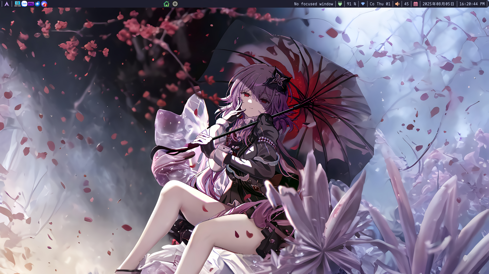
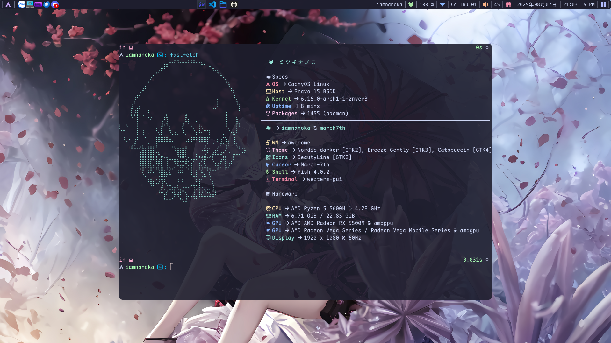
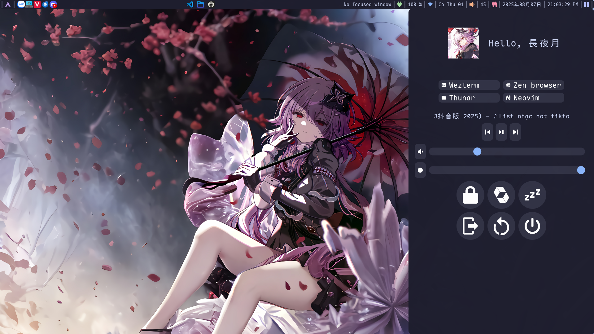
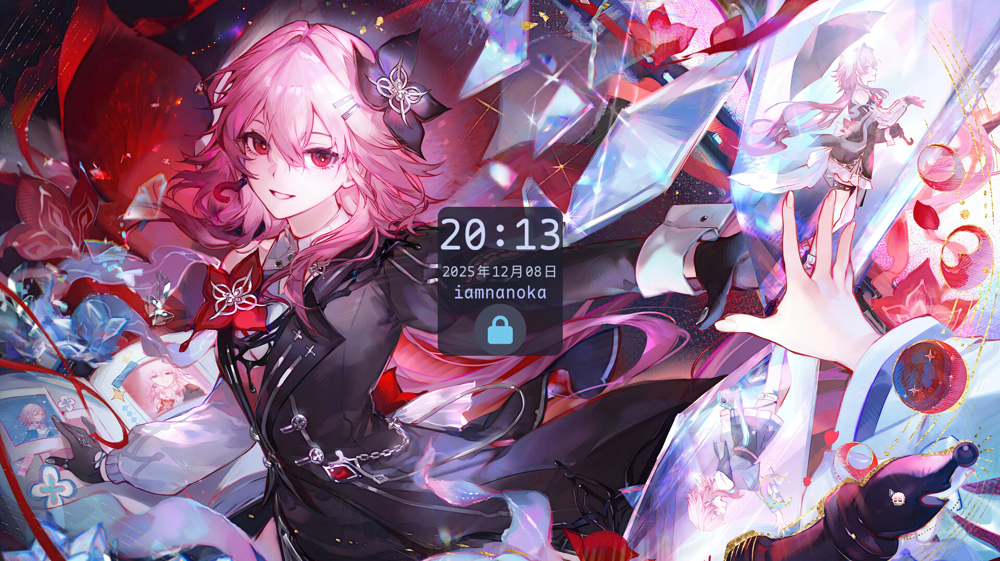

# 🌟 AwesomeWM Dotfiles • ミツキナノカ's Desktop Environment

<div align="center">

[](https://awesomewm.org/)
[](https://archlinux.org/)
[](LICENSE)
[](https://github.com/nhktmdzhg/dotfiles-wm/stargazers)

_A meticulously crafted, production-ready AwesomeWM desktop environment featuring modern aesthetics, smooth animations, and optimized performance for Arch Linux._

</div>

---

## 📸 Screenshots

<div align="center">

|        Desktop Overview        |        System Information        |             Dashboard             |            Lock screen             |
| :----------------------------: | :------------------------------: | :-------------------------------: | :--------------------------------: |
|     |   |    |  |
| _Clean Catppuccin Mocha theme_ | _Custom fastfetch configuration_ | _Integrated dashboard & controls_ |      _Integrated lock screen_      |

</div>

---

## ✨ Key Features

### 🎨 **Visual Design**

- **🌙 Catppuccin Mocha Theme** - Carefully balanced dark color palette
- **🎭 BeautyLine Icons** - Consistent, modern icon theme throughout the system
- **🔤 JetBrains Mono Nerd Font** - Programming-focused typography with icon support
- **🔔 Elegant Notifications** - Modern deadd-notification-center with popup and notification center

### ⚡ **Performance & Efficiency**

- **🚀 Optimized Resource Usage** - Minimal memory footprint with smart window management
- **🎯 Hardware Acceleration** - GLX backend with GPU-accelerated rendering
- **⚙️ Modular Architecture** - Clean Lua configuration split across logical modules
- **🔄 Efficient Autostart** - Selective application launching with duplicate prevention

### 🛠️ **Functionality**

- **📱 Custom Dashboard** - Integrated system controls and application launcher
- **🔒 Screen Locking** - custom lockscreen using awesome UI component and lua-pam
- **🛡️ Security Features** - physlock integration for absolute TTY protection during lock
- **🎵 Media Integration** - Full playerctl support for multimedia control
- **🖥️ Multi-monitor Ready** - Adaptive configuration for various display setups
- **⌨️ Intuitive Keybindings** - Logical shortcuts for efficient workflow

### 🔧 **Developer Experience**

- **📦 Automated Installation** - One-command setup with dependency management
- **📝 Comprehensive Documentation** - Detailed configuration and customization guides
- **🎯 Easy Customization** - Well-structured code with clear modification points

---

## 🧩 Core Components

| Component     | Purpose        | Configuration Path     | Description                              |
| ------------- | -------------- | ---------------------- | ---------------------------------------- |
| **AwesomeWM** | Window Manager | `~/.config/awesome/`   | Lua-based tiling WM with custom widgets  |
| **Rofi**      | Launcher       | `~/.config/rofi/`      | Application launcher with custom styling |
| **Deadd**     | Notifications  | `~/.config/deadd/`     | Modern notification center with popup UI |
| **Fastfetch** | System Info    | `~/.config/fastfetch/` | Modern system information display        |

---

## 📦 Package Dependencies

The configuration includes **32 carefully selected packages** optimized for performance and functionality:

### 🏗️ **Core System**

- `awesome` - High-performance AwesomeWM with Lua
- `fastcompr` - Lightweight compositor for X11
- `st` - Simple lightweight and customizable terminal emulator

### 🎨 **Theming & Appearance**

- `ttf-jetbrains-mono-nerd` - Programming font with icon support
- `noto-fonts` - Comprehensive Unicode font coverage
- `oxygen5` / `oxygen` - Dark Qt themes
- `qt5ct` / `qt6ct` - Qt configuration tools

### 🛠️ **Utilities & Tools**

- `rofi` - Application launcher and window switcher
- `deadd-notification-center` - Modern notification center and daemon
- `fastfetch` - Modern system information display
- `playerctl` - Media player control
- `brightnessctl` - Backlight control
- `shutter` - Screenshot tool

### 🔧 **System Integration**

- `bluez` / `bluez-utils` - Bluetooth support
- `upower` - Power management
- `lxqt-policykit` - Authentication agent
- `xss-lock` - Screen lock integration

> **Note**: All packages are automatically installed via the `install.sh` script with proper AUR helper detection.

---

## 🚀 Installation

### 📋 **System Requirements**

- **OS**: Arch Linux or Arch-based distribution (Manjaro, EndeavourOS, etc.)
- **Display**: X11 (Wayland not supported)
- **Memory**: Minimum 2GB RAM (4GB+ recommended)
- **Storage**: ~500MB for all packages and configurations

### ⚡ **Automated Installation**

The recommended installation method using the provided script:

```bash
# Clone the repository
git clone https://github.com/nhktmdzhg/dotfiles-wm.git ~/dotfiles
cd ~/dotfiles

# Run the automated installer
chmod +x install.sh
./install.sh
```

**What the installer does:**

1. ✅ **System Check** - Verifies Arch Linux and user permissions
2. 💾 **Backup Creation** - Backs up existing configurations to `~/.dotfiles-backup-*`
3. 📦 **AUR Helper** - Installs `paru` if no AUR helper is detected
4. 🔧 **Package Installation** - Installs all 32 required packages from `pkgs.txt`
5. 📁 **Configuration Deployment** - Copies all dotfiles to appropriate locations
6. 🔑 **Permission Setup** - Sets executable permissions for scripts
7. 🔤 **Font Cache** - Updates system font cache

### �️ **Manual Installation**

<details>
<summary><b>Step-by-step manual process</b></summary>

```bash
# 1. Install AUR helper (if needed)
sudo pacman -S --needed base-devel git
git clone https://aur.archlinux.org/paru-bin.git
cd paru-bin && makepkg -si

# 2. Install all packages
paru -S --needed $(cat ~/dotfiles/pkgs.txt | tr '\n' ' ')

# 3. Deploy configurations
cp -rf ~/dotfiles/home/username/. ~/

# 4. Set permissions
chmod +x ~/.config/awesome/lock.sh
chmod +x ~/.xinitrc

# 5. Update font cache
fc-cache -fv
</details>

### 🔄 **Post-Installation**

After installation, complete the setup:

1. **Logout** and select **AwesomeWM** from your display manager
2. **Login** to your new desktop environment
3. **Add wallpapers** to `~/wallpaper/` directory
4. **Test keybindings** using the reference below

---

## 🔐 Security Features

### 🛡️ **Advanced Screen Locking**

This configuration implements multiple layers of security for screen locking:

#### **Primary Layer: Custom AwesomeWM Lockscreen**

- **PAM Authentication** - Uses `lua-pam` for secure password verification
- **Beautiful UI** - Catppuccin Mocha themed lockscreen with wallpaper background
- **Hidden Password Input** - No password length indicators for security
- **Interactive Indicator** - Color-changing lock icon during typing

#### **Secondary Layer: Physlock TTY Protection**

- **Absolute TTY Blocking** - Prevents all TTY access when screen is locked
- **Kernel-level Security** - Bypasses user session entirely during lock
- **No Bypass Methods** - Completely blocks Ctrl+Alt+F1-F12 and other TTY switching
- **System-wide Protection** - Protects against physical access to terminals

#### **Integration Architecture**

```

┌─────────────────┐ ┌──────────────────┐ ┌─────────────────┐
│ AwesomeWM │ │ physlock │ │ PAM │
│ Lockscreen │───▶│ TTY Protection │───▶│ Authentication │
│ (lua-pam) │ │ (kernel level) │ │ (system auth) │
└─────────────────┘ └──────────────────┘ └─────────────────┘

````

**Usage:**

```bash
# Lock screen with both UI and TTY protection
~/.config/awesome/lock.sh

# Or use the keybinding: Super + L
````

**Security Benefits:**

- ✅ **No TTY Access** - Physical console access completely blocked
- ✅ **PAM Integration** - Uses system authentication framework
- ✅ **Visual Feedback** - Beautiful lockscreen with security indicators
- ✅ **Session Protection** - Prevents unauthorized session access
- ✅ **Multi-layer Defense** - UI lock + TTY lock + PAM auth

## 🔐 Security Features

### 🚀 **Essential Shortcuts**

| Shortcut            | Action               | Application         |
| ------------------- | -------------------- | ------------------- |
| `Super`             | Application Launcher | Rofi                |
| `Ctrl + Alt + T`    | Terminal             | St                  |
| `Super + E`         | File Manager         | PCManFM             |
| `Super + B`         | Web Browser          | Default Browser     |
| `Super + N`         | Text Editor          | Goneovim            |
| `Super + Ctrl + N`  | Toggle Notifications | deadd popup on/off  |
| `Super + Shift + N` | Notification Center  | deadd center toggle |
| `Super + Esc`       | Dashboard            | Custom Dashboard    |
| `Super + L`         | Lock Screen          | Custom Lockscreen   |

### 🪟 **Window Management**

| Shortcut            | Action           | Description                  |
| ------------------- | ---------------- | ---------------------------- |
| `Super + F`         | Fullscreen       | Toggle fullscreen mode       |
| `Super + X`         | Maximize         | Toggle window maximization   |
| `Super + Z`         | Minimize         | Iconify current window       |
| `Super + D`         | Show Desktop     | Hide/show all windows        |
| `Alt + F4`          | Close Window     | Terminate active application |
| `Alt + Tab`         | Window Switcher  | Cycle through open windows   |
| `Alt + Shift + Tab` | Reverse Switcher | Cycle windows in reverse     |
| `Super + ←→↑↓`      | Snap Window      | Move window to screen edges  |

### 🎵 **Media Controls**

| Shortcut               | Action         | Description            |
| ---------------------- | -------------- | ---------------------- |
| `XF86AudioPlay`        | Play/Pause     | Toggle media playback  |
| `XF86AudioNext`        | Next Track     | Skip to next track     |
| `XF86AudioPrev`        | Previous Track | Skip to previous track |
| `XF86AudioRaiseVolume` | Volume Up      | Increase system volume |
| `XF86AudioLowerVolume` | Volume Down    | Decrease system volume |
| `XF86AudioMute`        | Mute Toggle    | Toggle audio mute      |

### � **Screenshots & System**

| Shortcut                | Action             | Tool                    |
| ----------------------- | ------------------ | ----------------------- |
| `Print`                 | Screenshot Toolbar | shutter                 |
| `Ctrl + Print`          | Area Screenshot    | shutter (region select) |
| `Ctrl + Shift + Esc`    | System Monitor     | bottom                  |
| `XF86MonBrightnessUp`   | Brightness +       | brightnessctl           |
| `XF86MonBrightnessDown` | Brightness -       | brightnessctl           |
| `Super + Ctrl + R`      | Reload WM          | Restart AwesomeWM       |

---

## 🎨 Customization Guide

### 🌈 **Color Themes**

The configuration uses **Catppuccin Mocha** as the base theme. To customize colors:

```lua
-- Edit ~/.config/awesome/mocha.lua
return {
    name = 'mocha',
    base = { hex = '#1e1e2e' },      -- Background
    text = { hex = '#cdd6f4' },      -- Foreground text
    blue = { hex = '#89b4fa' },      -- Primary accent
    mauve = { hex = '#cba6f7' },     -- Secondary accent
    -- ... 26 total color definitions
}
```

### 🖼️ **Wallpapers**

Add your wallpapers to the `~/wallpaper/` directory. Then edit the config in `~/.config/awesome/config/wibar.lua` to change the wallpaper:

```bash
# Add wallpapers
cp your-wallpaper.jpg ~/wallpaper/
```

```lua
-- Edit ~/.config/awesome/config/wibar.lua
screen.connect_signal('request::wallpaper', function(s)
	wallpaper.maximized(vars.wallpaper, s, true)
end)
```

### ⚙️ **Default Applications**

Modify default applications in `~/.config/awesome/config/keys.lua`:

```lua
-- Example: Change default terminal
key({ ctrl, alt }, "t", function()
    spawn("alacritty")  -- Replace with your preferred terminal
end),

-- Example: Change default browser
key({ super }, "b", function()
    spawn("firefox")    -- Replace with your preferred browser
end),
```

### 🎛️ **Dashboard Customization**

The custom dashboard can be modified in `~/.config/awesome/config/dashboard.lua`:

- **Add/remove quick actions**
- **Modify power menu options**
- **Customize media controls**
- **Change layout and styling**

### 🔧 **AwesomeWM Configuration**

Key configuration files and their purposes:

| File                 | Purpose            | Customization Options           |
| -------------------- | ------------------ | ------------------------------- |
| `rc.lua`             | Main entry point   | Theme selection, module loading |
| `theme.lua`          | Visual styling     | Colors, fonts, spacing          |
| `config/keys.lua`    | Keybindings        | Shortcuts, applications         |
| `config/rules.lua`   | Window rules       | Placement, properties           |
| `config/widgets.lua` | Status bar widgets | System monitoring, layout       |

---

## 🔗 Recommended Companions

Enhance your desktop experience with these complementary configurations:

| Component      | Description                      | Repository                                                        |
| -------------- | -------------------------------- | ----------------------------------------------------------------- |
| **🔧 Neovim**  | Modern Vim-based editor with LSP | [nhktmdzhg/nvim](https://github.com/nhktmdzhg/nvim)               |
| **🌐 Browser** | Zen Browser configuration        | [nhktmdzhg/zen-browser](https://github.com/nhktmdzhg/zen-browser) |

---

## 🐛 Troubleshooting

### 🔧 **Common Issues**

<details>
<summary><b>Installation Problems</b></summary>

**AUR Helper Installation Fails**

```bash
# Manual paru installation
sudo pacman -S --needed base-devel git
git clone https://aur.archlinux.org/paru-bin.git
cd paru-bin && makepkg -si --noconfirm
```

**Package Installation Errors**

```bash
# Update system first
sudo pacman -Syu
# Clear package cache
paru -Sc
# Retry installation
paru -S --needed $(cat ~/dotfiles/pkgs.txt | tr '\n' ' ')
```

</details>

<details>
<summary><b>Runtime Issues</b></summary>

**Font Rendering Problems**

```bash
# Rebuild font cache
fc-cache -fv
# Verify JetBrains Mono installation
fc-list | grep -i jetbrains
```

**AwesomeWM Won't Start**

```bash
# Check configuration syntax
awesome -k ~/.config/awesome/rc.lua
# View error logs
journalctl -u display-manager -f
```

</details>

<details>
<summary><b>Permission Fixes</b></summary>

```bash
# Fix script permissions
chmod +x ~/.config/awesome/lock.sh
chmod +x ~/.xinitrc

# Fix ownership issues
sudo chown -R $USER:$USER ~/.config/
```

</details>

---

## 🤝 Contributing

We welcome contributions to improve this AwesomeWM configuration! Here's how you can help:

### 🐛 **Bug Reports**

- Use the [issue tracker](https://github.com/nhktmdzhg/dotfiles-wm/issues) to report bugs
- Include system information (OS, AwesomeWM version, etc.)
- Provide steps to reproduce the issue

### ✨ **Feature Requests**

- Suggest new features or improvements
- Explain the use case and expected behavior
- Consider submitting a pull request if you can implement it

### 🔧 **Pull Requests**

1. **Fork** the repository
2. **Create** a feature branch: `git checkout -b feature/amazing-feature`
3. **Test** your changes thoroughly
4. **Commit** with clear messages: `git commit -m 'Add amazing feature'`
5. **Push** to your branch: `git push origin feature/amazing-feature`
6. **Open** a Pull Request with detailed description

---

## 📄 License

This project is licensed under the **MIT License** - see the [LICENSE](LICENSE) file for complete details.

```
MIT License - Free to use, modify, and distribute
```

---

## 🙏 Acknowledgments

Special thanks to the amazing open-source community:

- **[AwesomeWM](https://awesomewm.org/)** - The incredibly flexible and powerful window manager
- **[Catppuccin](https://catppuccin.com/)** - Beautiful, soothing pastel color palette
- **[BeautyLine](https://github.com/gvolpe/BeautyLine)** - Elegant and consistent icon theme
- **[Arch Linux](https://archlinux.org/)** - The simple, lightweight distribution
- **Community Contributors** - Everyone who tested, reported issues, and suggested improvements

---

<div align="center">

### 🌟 **Show Your Support**

If this configuration helped you create an amazing desktop experience, please consider:

[](https://github.com/nhktmdzhg/dotfiles-wm/stargazers)
[](https://github.com/nhktmdzhg/dotfiles-wm/network/members)

**Made with 💙 by [ミツキナノカ](https://github.com/nhktmdzhg)**

_Crafted for developers, by developers_

</div>
