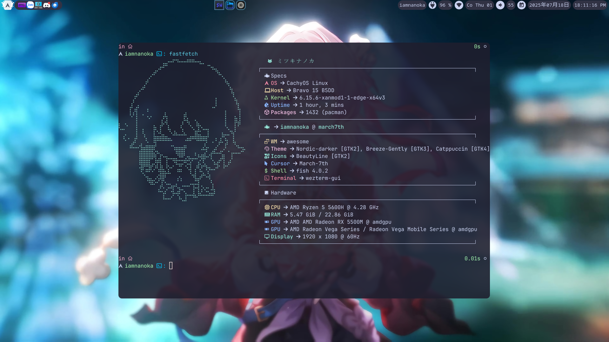

# 🌟 AwesomeWM • ミツキナノカ's Elite Desktop Environment

<div align="center">

[](https://awesomewm.org/)
[](https://archlinux.org/)
[](LICENSE)

_A meticulously crafted, production-ready desktop environment featuring modern aesthetics, blazing performance, and seamless user experience._

</div>

---

## 📸 Gallery

<details>
<summary><b>🖼️ Desktop Showcase</b></summary>


_Catppuccin Mocha themed desktop with minimal, elegant design_

_Fastfetch displaying system information with custom theme and anime girl logo_
</details>

---

## ✨ Features

### 🎨 **Visual Excellence**

- **Theme**: Catppuccin Mocha color palette with carefully balanced contrast
- **Compositor**: Picom with smooth animations and transparency effects
- **Modern Window Animations**: Clean, professional window transitions with smooth scaling and fading
- **Icons**: BeautyLine icon theme for consistent visual language
- **Typography**: JetBrainsMono Nerd Font for crisp readability and icon support
- **Notifications**: Custom Dunst configuration with elegant notifications

### 🎬 **Smooth Animation System**

- **Elegant Open**: Smooth fade-in with gentle scale-up and subtle slide-down effect
- **Natural Close**: Graceful fade-out with scale-down and gentle upward slide
- **Seamless Show/Hide**: Simple fade transitions with minimal scale adjustments
- **Fluid Geometry**: Smooth transitions for window resizing and repositioning
- **Optimized Performance**: Sub-300ms animations for responsive user experience
- **Professional Quality**: Cubic-bezier curves for natural, smooth motion

### ⚡ **Performance Optimized**

- **Minimal Resource Usage**: Floating layout with smart window management
- **Hardware Acceleration**: GLX backend with damage tracking
- **Optimized Rendering**: Zero-copy compositing and GPU acceleration
- **Efficient Autostart**: Selective process spawning with duplicate prevention

### 🛠️ **Developer Experience**

- **Modular Configuration**: Clean separation of concerns across multiple Lua modules
- **Custom Widgets**: Handcrafted status bar with system monitoring
- **Extensible Design**: Easy customization and plugin integration
- **Version Control**: Git-tracked with selective ignore patterns

### 🔧 **System Integration**

- **Session Management**: Comprehensive logout/shutdown menu with wlogout
- **Screen Locking**: betterlockscreen integration with automatic timeout
- **Media Controls**: Full playerctl integration for multimedia management

---

## 🏗️ Architecture

### 📁 **Project Structure**

```
dotfiles/
├── 📄 install.sh           # Automated installation script
├── 📄 pkgs.txt             # Dependency package list
├── 🏠 home/username/       # User configuration files
    ├── ⚙️  .config/
    │   ├── 🪟 awesome/     # AwesomeWM configuration
    │   │   ├── 📝 rc.lua           # Main entry point
    │   │   ├── 🎨 theme.lua        # Visual theming
    │   │   ├── 🌙 mocha.lua        # Catppuccin palette
    │   │   ├── 📜 scripts.lua      # Utility functions
    │   │   └── 📂 config/          # Modular components
    │   │       ├── 🔧 autostart.lua    # Startup applications
    │   │       ├── ⌨️ keys.lua         # Keybinding definitions
    │   │       ├── 📏 rules.lua        # Window placement rules
    │   │       ├── 📊 widgets.lua      # Custom UI components
    │   │       ├── 📱 wibar.lua        # Status bar configuration
    │   │       ├── 📡 signals.lua      # Event handling
    │   │       └── 🔧 vars.lua         # Global variables
    │   ├── 💬 dunst/       # Notification daemon
    │   ├── 🔍 rofi/        # Application launcher
    │   ├── 💻 wezterm/     # Terminal emulator
    │   ├── 🌸 picom.conf   # Compositor settings
    │   ├── 🚀 fastfetch/   # System info display
    │   ├── 🔒 betterlockscreen/    # Screen locker
    │   ├── 🎨 gtk-4.0/             # GTK4 theming
    │   └── ⚙️  qt5ct/qt6ct/ # Qt theming
    ├── 🖼️ .local/share/icons/ # BeautyLine icon theme
    ├── 🏠 .xinitrc         # X11 session startup
    ├── 🎨 .Xresources      # X11 resource definitions
    └── 🖱️ .gtkrc-2.0       # GTK2 configuration
```

### 🧩 **Core Components**

| Component     | Purpose        | Configuration                      |
| ------------- | -------------- | ---------------------------------- |
| **AwesomeWM** | Window Manager | `~/.config/awesome/`               |
| **Picom**     | Compositor     | `~/.config/picom.conf`             |
| **Dunst**     | Notifications  | `~/.config/dunst/dunstrc`          |
| **Rofi**      | App Launcher   | `~/.config/rofi/config.rasi`       |
| **WezTerm**   | Terminal       | `~/.config/wezterm/wezterm.lua`    |
| **Fastfetch** | System Info    | `~/.config/fastfetch/config.jsonc` |

---

## 🎬 Animation Configuration

### ✨ **Smooth Window Transitions**

The picom configuration features professional, smooth animations:

```yaml
# SMOOTH OPEN ANIMATIONS
- Gentle fade-in with opacity transition (0.3s)
- Subtle scale-up from 95% to 100% size
- Light slide-down effect from 20px above
- Natural cubic-bezier easing curves

# NATURAL CLOSE ANIMATIONS  
- Graceful fade-out with smooth opacity transition (0.25s)
- Gentle scale-down to 90% size
- Subtle upward slide by 15px
- Professional easing for natural motion

# TRIGGERS
- Window open/close: Smooth fade and scale transitions
- Window show/hide: Simple fade effects with minimal scaling
- Geometry changes: Fluid transitions for resizing and movement
```

### ⚡ **Performance Metrics**

- **Open Animation**: 300ms total duration
- **Close Animation**: 250ms total duration  
- **Show/Hide**: 150-200ms for instant feedback
- **Geometry**: 150ms for responsive resizing
- **Backend**: Hardware-accelerated GLX with damage tracking

---

## 🚀 Installation

### 📋 **Prerequisites**

- **Operating System**: Arch Linux (or Arch-based distribution)
- **Display Server**: X11
- **AUR Helper**: yay, paru, trizen, or pikaur (auto-installed if missing)

### ⚡ **Quick Start**

```bash
# Clone the repository
git clone https://github.com/nhktmdzhg/dotfiles-wm.git ~/dotfiles
cd ~/dotfiles

# Make scripts executable
chmod +x install.sh link.sh

# Install all dependencies and configurations
./install.sh
```

### 🔧 **Manual Installation**

<details>
<summary><b>Step-by-step installation process</b></summary>

```bash
# 1. Install dependencies from package list
cat pkgs.txt | xargs sudo pacman -S --needed

# 2. Copy configuration files
cp -rf home/username/. ~/

# 3. Set executable permissions
chmod +x ~/.config/awesome/xss-lock-tsl.sh

# 4. Reload font cache
fc-cache -fv
```

</details>

---

## ⌨️ **Keybindings Reference**

### 🪟 **Window Management**

| Shortcut    | Action       | Description                  |
| ----------- | ------------ | ---------------------------- |
| `Super + F` | Fullscreen   | Toggle fullscreen mode       |
| `Super + X` | Maximize     | Toggle window maximization   |
| `Super + Z` | Minimize     | Iconify current window       |
| `Super + D` | Show Desktop | Hide/show all windows        |
| `Alt + F4`  | Close Window | Terminate active application |

### 🔄 **Navigation**

| Shortcut            | Action           | Description                 |
| ------------------- | ---------------- | --------------------------- |
| `Alt + Tab`         | Window Switcher  | Cycle through open windows  |
| `Alt + Shift + Tab` | Reverse Switcher | Cycle windows in reverse    |
| `Super + ←→↑↓`      | Move Window      | Snap window to screen edges |

### 🚀 **Applications**

| Shortcut             | Action         | Default Application   |
| -------------------- | -------------- | --------------------- |
| `Super`              | App Launcher   | Rofi application menu |
| `Ctrl + Alt + T`     | Terminal       | WezTerm               |
| `Super + E`          | File Manager   | Thunar                |
| `Super + B`          | Web Browser    | Zen Browser           |
| `Super + N`          | Text Editor    | Goneovim              |
| `Ctrl + Shift + Esc` | System Monitor | Bottom                |

### 📱 **System Controls**

| Shortcut           | Action       | Description          |
| ------------------ | ------------ | -------------------- |
| `Super + L`        | Screen Lock  | betterlockscreen     |
| `Super + Esc`      | Session Menu | Logout/shutdown menu |
| `Super + Ctrl + R` | Reload WM    | Restart AwesomeWM    |

### 📸 **Media & Screenshots**

| Shortcut               | Action           | Description              |
| ---------------------- | ---------------- | ------------------------ |
| `Print`                | Full Screenshot  | Capture entire screen    |
| `Ctrl + Print`         | Area Screenshot  | Select region to capture |
| `XF86AudioPlay`        | Play/Pause       | Media playback control   |
| `XF86AudioNext/Prev`   | Track Navigation | Skip tracks              |
| `XF86AudioRaiseVolume` | Volume Up        | Increase system volume   |
| `XF86AudioLowerVolume` | Volume Down      | Decrease system volume   |
| `XF86AudioMute`        | Mute Toggle      | Toggle audio mute        |

### 💡 **Display Controls**

| Shortcut                | Action       | Description                |
| ----------------------- | ------------ | -------------------------- |
| `XF86MonBrightnessUp`   | Brightness + | Increase screen brightness |
| `XF86MonBrightnessDown` | Brightness - | Decrease screen brightness |

---

## 🎨 **Customization**

### 🌈 **Color Scheme**

The configuration uses the **Catppuccin Mocha** palette. To modify colors:

```lua
-- Edit ~/.config/awesome/mocha.lua
return {
    name = "mocha",
    base = { hex = "#1e1e2e" },     -- Background
    text = { hex = "#cdd6f4" },     -- Foreground
    accent = { hex = "#89b4fa" },   -- Primary accent
    -- ... customize other colors
}
```

### 🖼️ **Wallpaper**

Place your wallpaper in `~/wallpaper/` and update the path in `~/.config/awesome/config/wibar.lua`:

```lua
-- Edit wallpaper path in wibar configuration
wallpaper.maximized(vars.home .. "/wallpaper/your-wallpaper.jpg", s, true)
```

### ⚙️ **Applications**

Modify default applications in `~/.config/awesome/config/keys.lua`:

```lua
-- Change default terminal
key({ ctrl, alt }, "t", function()
    spawn("your-preferred-terminal")
end),
```

---

## 🔗 **Recommended Companions**

| Category        | Recommendation       | Repository                                                        |
| --------------- | -------------------- | ----------------------------------------------------------------- |
| **Text Editor** | Neovim Configuration | [nhktmdzhg/nvim](https://github.com/nhktmdzhg/nvim)               |
| **Browser**     | Zen Browser          | [nhktmdzhg/zen-browser](https://github.com/nhktmdzhg/zen-browser) |

---

## 🐛 **Troubleshooting**

<details>
<summary><b>Common Issues & Solutions</b></summary>

### Font Rendering Issues

```bash
# Rebuild font cache
fc-cache -fv
# Verify font installation
fc-list | grep -i jetbrains
```

### Compositor Not Starting

```bash
# Check Picom configuration
picom --config ~/.config/picom.conf --check-config
# Test with default config
picom --experimental-backends
```

### Missing Dependencies

```bash
# Reinstall all packages
cat ~/dotfiles/pkgs.txt | xargs paru -S --needed
```

### Permission Issues

```bash
# Fix executable permissions
chmod +x ~/.config/awesome/xss-lock-tsl.sh
chmod +x ~/.xinitrc
```

</details>

---

## 🤝 **Contributing**

Found a bug or have an enhancement idea?

1. **Fork** this repository
2. **Create** a feature branch: `git checkout -b feature/amazing-feature`
3. **Commit** your changes: `git commit -m 'Add amazing feature'`
4. **Push** to the branch: `git push origin feature/amazing-feature`
5. **Open** a Pull Request

---

## 📄 **License**

This project is licensed under the **MIT License** - see the [LICENSE](LICENSE) file for details.

---

## 🙏 **Acknowledgments**

- **[AwesomeWM](https://awesomewm.org/)** - The incredibly flexible window manager
- **[Catppuccin](https://catppuccin.com/)** - Beautiful, soothing color palette
- **[BeautyLine](https://github.com/gvolpe/BeautyLine)** - Elegant icon theme
- **Community** - All the contributors and testers who made this possible

---

<div align="center">

**⭐ Star this repository if you found it helpful!**

Made with 💙 by [ミツキナノカ](https://github.com/nhktmdzhg)

</div>
